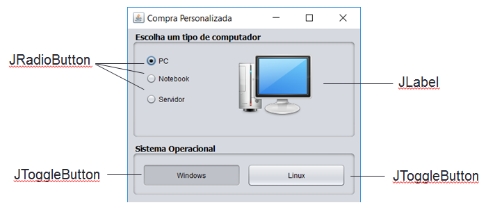
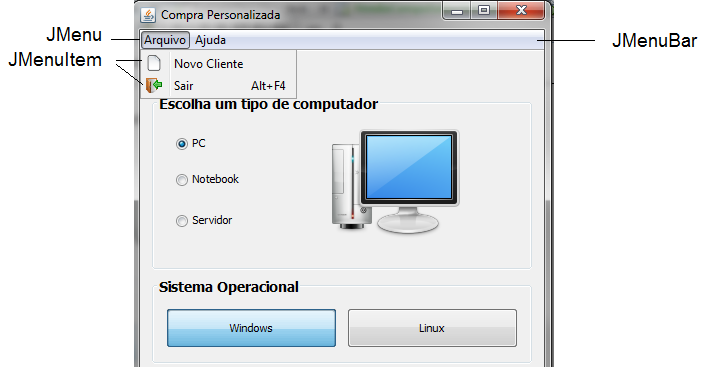
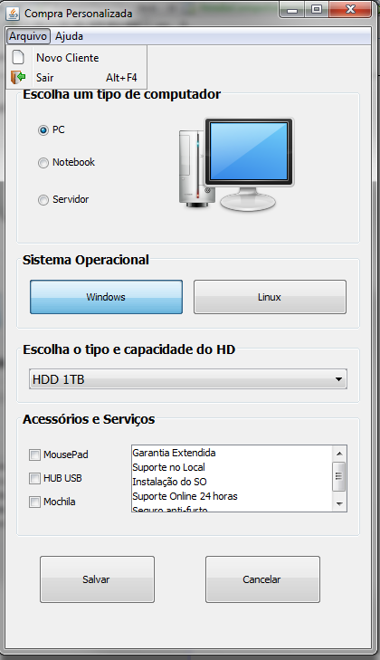

# PI2 - Controles Swing - Avançado
Apresentar controles que mantém estado e navegação por menus em uma aplicação Desktop

### Tarefa 1 - Controles de Grupo



1.1 Adicione 3 controles _JRadioButtons_ e _1 controle ButtonGroup_ conforme prototótipo acima. 
Para cada _JRadioButton_ defina o mesmo objeto _ButtonGroup_ (Ex: grupoTipoComputador) utilizando a propriedade buttonGroup do JRadioButton.

1.2 Adicione 2 controles _JToggleButton_ para a seleção do sistema operacional (Windows ou Linux). Adicione outro _JButtonGroup_ (Ex: grupoSistemaOperacional) para deixar apenas uma opção ativa.

1.3 Ao clicar em cada _JRadioButton_, altere o ícone do JLabel com a imagem correspondente ao texto de cada botão. Ex: <br />
<code>this.lblImagem.setIcon(new ImageIcon(getClass().getResource("/pc.png")));</code>

### Tarefa 2 - Trabalhando com Menus



2.1 - Adicione a este formulário 1 controle _JMenuBar_ e 2 controles _JMenu_ com os textos “Arquivo” e “Ajuda” conforme protótipo acima. <br />

2.2 - No Menu Arquivo, adicione 2 controles _JMenuItem_ com os textos "Novo Cliente" e "Sair" <br />

2.2.1 - Adicione o ícone "novo.png" ao menu "Novo Cliente" e ao clicar neste menu, exiba o formulário "CadastroClienteView". Ex: <br />
```
CadastroClienteView novoCliente = new CadastroClienteView();
novoCliente.setVisible(true);
```

2.2.2 - Adicione o ícone "sair.png" ao menu "Sair" e adicione um atalho (_accelerator_) com a combinação Alt+F4.

### Tarefa 3 - ADO 1



3.1 Adicione um _JComboBox_ para a seleção da capacidade do HD com as opções “HDD 1TB”, “SSD 256 GB” e “SSD 1TB” <br />

3.2 Adicione 3 componentes _JCheckBox_ para a seleção de acessórios do computador (“MousePad”, “Hub USB” e “Mochila”) <br />

3.3 Adicione um componente _JList_ para a seleção de serviços adicionais (Garantia Extendida, Suporte no Local, Suporte 24 horas e Instalação do SO) <br />

3.4 Na Classe Computador, defina as seguintes propriedades:<br />

* ***Variável de Classe:*** String static fabricante = “seu nome”; <br />

* ***Variáveis de instância (objeto):*** String tipoComputador, String sistemaOperacional, String HD, String[] acessorios, String[] serviços <br />

3.5 Crie ao menos 1 Construtor vazio e implemente todos os _getters_ e _setters_ das propriedades acima <br />

3.6 Ao clicar em Salvar, armazene as informações selecionadas na tela em um objeto desta classe “Computador” e; <br />

3.7 Exiba uma mensagem de diálogo ao usuário “Obrigado por comprar um ” + “[TipoComputador]” + “com ” + “[Sistema Operacional]” , resgatando os valores do objeto instanciado da classe “Computador”.

3.8 Faça o commit no github, com mensagem de commit 'ADO' ou 'entrega ADO' até a data e horário estipulados.
